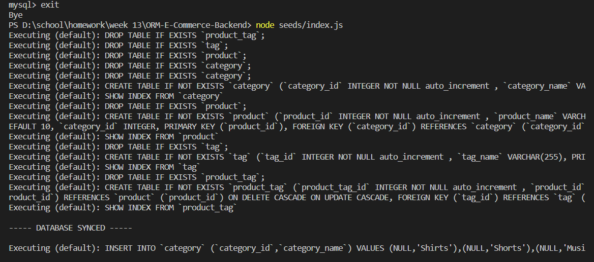
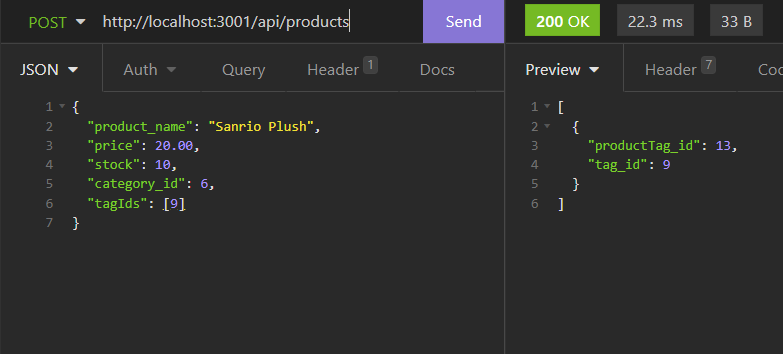

# Navigating an E-Commerce Back End Using Object-Relational Mapping

## Description 
Using the Sequelize module, this app allows the user to view and change the inventory of an e-commerce site without extensive interface through MySQL. Users can view, add, delete, and alter product categories, products, and product tags through API routes using an API client. 

Sequelize allows the viewer to set up and seed the database without extensive use of the MySQL shell as most data and functionality is coded through Javascript and JSON formats. MySQL is only needed to create the initial database. Data seeding occurs within Node, and API/HTTP requests can be made within an API client like Insomnia.

### Technologies
- Javascript/Node.js
- Express.js
- MySQL
- MySQL2 module
- Sequelize module
- Dotenv module
- Insomnia API Client (or any API client)
(Starter code was also provided.)

## Installation Instructions
```npm i```
Please also make sure Insomnia and MySQL are properly installed and set up.

## Usage Instructions
To set up the database, open up the terminal and connect to the MySQL shell with this command: 
```mysql -u root -p```
Enter the password, and once the connection is properly set up enter: 
```SOURCE db/schema.sql;```
The file path may vary depending on where you opened the terminal.

Now that the initial database has been created, exit from the MySQL shell, but stay within the terminal. To seed the database with initial data, enter: 
```node seeds/index.js```
Then the server can be properly started using the command `node server.js`.

Within the API client, the base URL is "http://localhost:3001/api/". You must append "categories", "products", or "tags" at the end to view the appropriate sections when performing a GET request to see all the entries within each section. To view individual entries, append the ID number of whichever category, product, and/or tag to view. To POST a new category or tag, the JSON body only requires the name of the new section, like the example below: 
```
{
    "tag_name": "food"
}
```
To POST a new product, more info is needed: 
```
{
    "product_name": "",
    "price": (decimal), 
    "stock": (integer), 
    "category_id": (integer), 
    "tagIds": [(IDs)],
}
```
Where tagIds is an array that can hold multiple tag IDs if needed.

To PUT/update an individual entry, call the route using the entry's ID number and the JSON body structures will be the same as POST requests.

To DELETE an entry, call the route with the individual ID similar to a PUT request, but no JSON body is required. 

[Watch a demo video here.](https://youtu.be/E5pvfVt4YYY)

### Screenshots




## License
This project is MIT licensed. 

## Contact
- [GitHub](https://github.com/reversedentistry)
- Email: sherylhu@proton.me